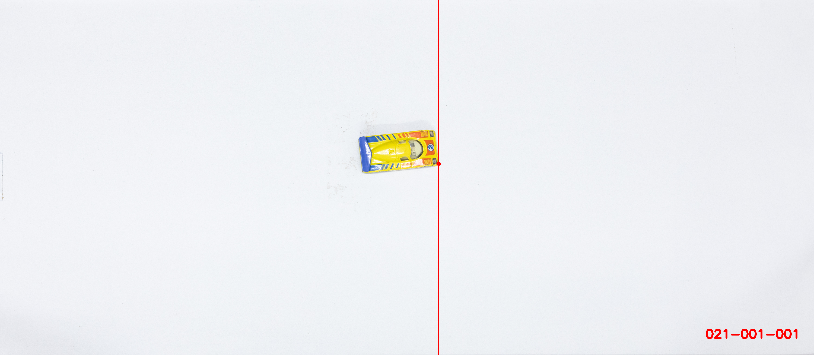
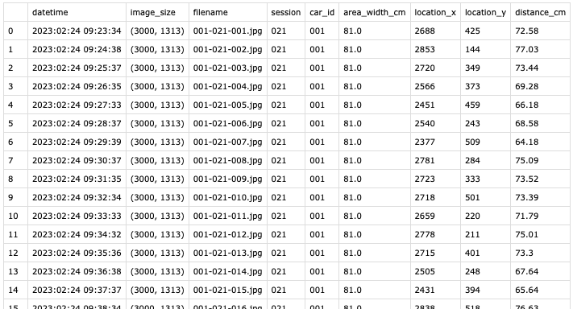

# Toy Cars

A computer vision tool for gathering object location data from images and generating data visualizations. This tool was exclusively designed for an art project by Tuomas Linna.

## Assignment

Over 20000 image dataset was collected by sending 21 different toy cars down the ramp and and taking an image of each dispatch. The task was to calculate the distance traveled on every dispatch and provide a .csv-format dataset for the artist.

The distance car traveled is calculated from extracted x-coordinate and the known real-world width of the area in the image. Image metadata is also collected.

## Image processing

<figure>
    <figcaption>Example image</figcaption>
  
  
  

  
  
</figure>

  
.

  
.

  
.

<figure>
    <figcaption>Blur</figcaption>
  
  
  
</figure>

.

  
.

  
.

<figure>
    <figcaption>Convert to grayscale</figcaption>
  
  
  
</figure>

.

  
.

  
.

<figure>
    <figcaption>Convert to binary image</figcaption>
  
  
  
</figure>

.

  
.

  
.

<figure>
    <figcaption>Dilate to increase the size of white area in the binary image</figcaption>
  
  
  
</figure>

.

  
.

  
.

<figure>
    <figcaption>Find contours in the processed image</figcaption>
  
  
  
</figure>

.

  
.

  
.

<figure>
    <figcaption>Find coordinates for extreme right of largest area of contours</figcaption>
  
  
  
</figure>

.

  
.

  
.

<figure>
    <figcaption>Final</figcaption>
  
  
  
</figure>

<figure>
    <figcaption>Sample CSV</figcaption>
  
  
  
</figure>

<figure>
    <figcaption>Debug video</figcaption>
  
  
  
</figure>
